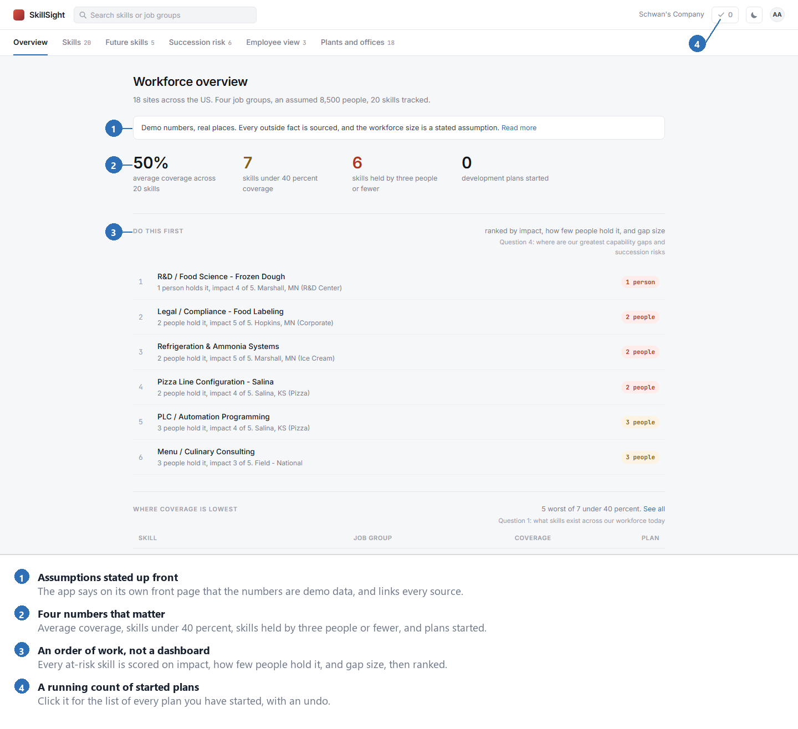
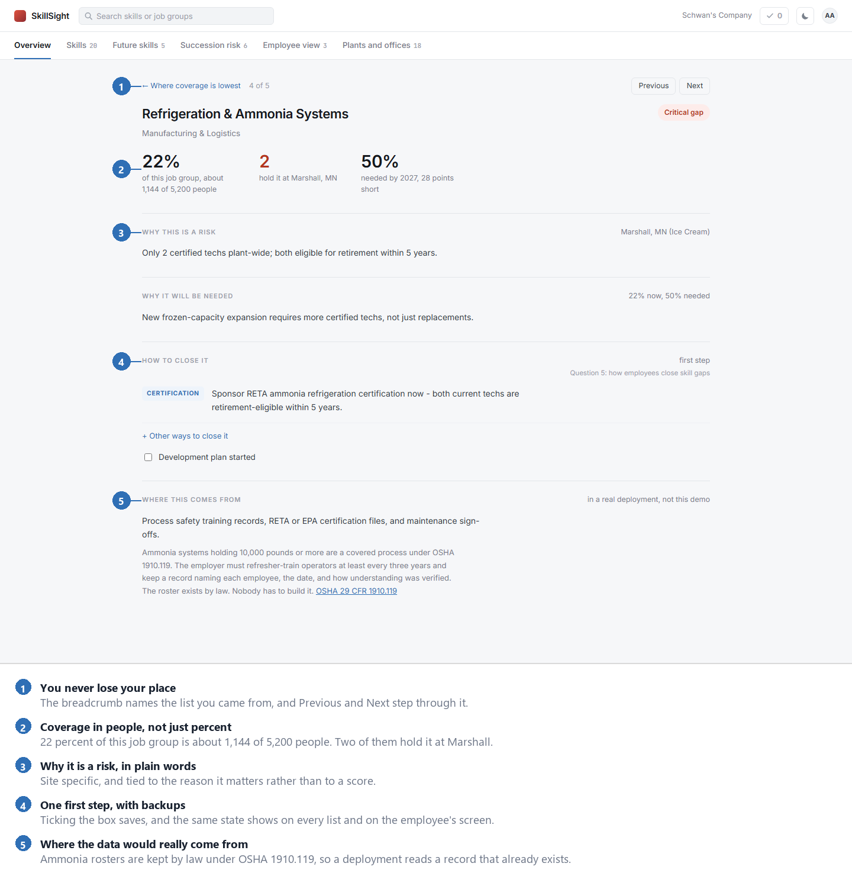
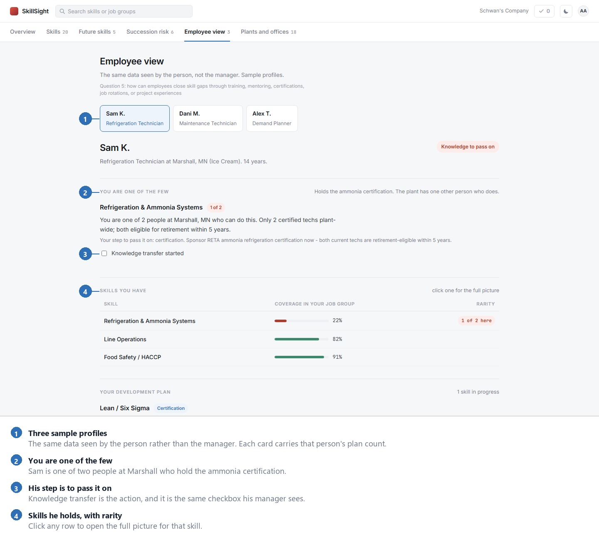

# SkillSight

A tool that shows what skills a workforce has, where those skills are missing, and where a critical one is known by too few people.

Built solo in about 24 hours at **Southwest MN Hacks 2026** (September 12 to 13, Marshall, Minnesota) for **Schwan's Prompt 01: Talent Readiness and Skills Intelligence Platform**. Submitted and demoed on the morning of the 13th. It did not place in the top five, and no judge feedback was given. This repository is the entry as it stood at submission.



## The challenge

The prompt asked for a solution that helps an organization understand its current workforce capability, find critical gaps, assess future needs, and act on them. It listed five questions the platform should answer:

1. What skills exist across the workforce today?
2. What skills will be needed for future business and technology strategies?
3. Which critical skills are concentrated in only a few individuals?
4. Where are the greatest capability gaps and succession risks?
5. How can employees close skill gaps through training, mentoring, certifications, job rotations, or project experiences?

Schwan's runs more than a dozen US facilities across four job groups. Skills data sits in different systems, so a simple question has no simple answer: if the person who knows the ammonia refrigeration system leaves, who else can do it?

## What was built

Six pages, one per question, in the order the challenge asks them.

| Page | Answers |
|---|---|
| **Overview** | Question 4: the greatest gaps and succession risks, as a ranked order of work |
| **Skills** | Question 1: what skills exist and how well each is covered |
| **Future skills** | Question 2: what the next two years need, and the shortfall |
| **Succession risk** | Question 3: which skills sit with three people or fewer, where, and what it costs |
| **Employee view** | Question 5: the same data seen by the person rather than the manager |
| **Plants and offices** | Every site the data covers |

Click any row anywhere in the app and you land on that skill: coverage expressed in people rather than percent, why it is a risk, why it will be needed, the first step to close the gap with backup options, and where that data would come from in a real deployment. Marking a plan as started is saved in the browser and shows up on every list that contains that skill.

**A skill page.**



**The employee view.** The challenge asks how *employees* close skill gaps, so one screen is built for them rather than about them.



## The idea that mattered

Most workforce dashboards display numbers and stop, leaving the hardest decision, which problem to touch first, with the reader.

SkillSight scores every at-risk skill on three things and sorts them:

```
score = impact out of 5   ×   3 ÷ number of holders   ×   size of the coverage gap
```

The formula is shown on screen rather than hidden behind a badge. In the demonstration data it ranks frozen dough formulation first, not because its coverage is lowest, but because a single person holds it. That is the behaviour a succession instrument should have, and it turns a view of the situation into an order of work.

## Answering "we do not have this data"

The usual objection to any skills tool is that the underlying data does not exist. In regulated manufacturing it largely does, so every skill page names the systems a real deployment would read from.

Ammonia refrigeration is the clearest case. Systems holding 10,000 pounds or more are a covered process under OSHA 1910.119, which requires refresher training at least every three years and a record naming each trained employee and the date. Food safety has a similar hook: a facility's written food safety plan must be prepared, or its preparation overseen, by a preventive controls qualified individual.

One skill, the Salina line configuration, says plainly that it has no system of record anywhere. That is the finding, not a gap in the tool.

## What is real and what is not

Coverage percentages, per-site headcounts and employee records are **simulated**, and the app says so on its own front page.

Real and sourced: the four job groups (Schwan's own career areas), the plant and office locations, the Sioux Falls build-out, the Salina expansion, the CJ CheilJedang ownership, and the regulations above.

The workforce size of about 8,500 is a stated assumption, because the company does not publish a headcount and third-party estimates disagree.

During the build every external claim was audited in three passes. Three claims were removed because they could only be traced to vendor blogs, and one factual error was corrected: Sioux Falls is an Asian-style food plant, not a pizza plant. The full audit, with sources, is in [FACTS.md](FACTS.md).

## Run it

No install, no build step, no internet needed.

```
open index.html in a browser
```

Light and dark toggle in the top right, remembered between visits.

## Self-check

State spans six pages and five lists, and manual testing proved unreliable: a bug where plans saved from one list were invisible in another survived several rounds of clicking. So the app ships with a verification script.

```
node verify.js
```

It renders every page in a stub DOM and asserts that every clickable row opens a real page, that every skill page carries a plan or states why it has none, that a started plan appears in every list containing that skill across 42 combinations, that Previous and Next are correct at all 42 positions, and that the data obeys the rule the interface states on screen.

## How it was built

Plain HTML, CSS and JavaScript in four files. No framework, no build step, no dependencies, and nothing loaded from a CDN, so it runs with no internet and could not break on venue wifi during judging.

Three interface designs were built and discarded first. One used a risk matrix and several charts, which looked impressive and told the viewer nothing actionable. One put a data list in a left-hand column, which reads as navigation and confused the eye. One showed all twenty skills in a single table, which is a wall rather than an answer. The charting library was removed entirely along the way.

The generators in `tools/` are separate from the app. They build the deck and the written brief and do need Node packages (`pptxgenjs`, `docx`). Nothing in the app depends on them.

## Read more

The full write-up is [BRIEF.md](BRIEF.md), rendered in the browser: abstract, method, results with tables, discussion, references and four appendices. Same paper in APA layout with page numbers: [SkillSight-Brief.pdf](exports/SkillSight-Brief.pdf).

The three minute pitch deck is [SkillSight-Deck.pdf](exports/SkillSight-Deck.pdf).

## Files

```
index.html    page shell: top bar, tabs, content area
style.css     all styling and both themes
script.js     app logic and page rendering
data.js       the data the app reads
verify.js     self-check, run with node
BRIEF.md      the written brief, readable in the browser
FACTS.md      every outside claim, its source, and what was cut
exports/      the brief and the deck, as PDF
tools/        generators for the deck and the brief, plus a layout checker
screenshots/  the three images used in this README
```

## What would come next

This is a hackathon entry, not a product, and it is no longer under active development. If it were taken further, in order:

1. Connect to a human resources system so coverage comes from records rather than seeds.
2. Model development plans as records with an owner, a date and a status, instead of browser storage keyed by skill.
3. Match people to plans automatically, using the skills they already hold, rather than one written first step per skill.
4. A manager's view of one team, since that is who would open it weekly.

## Credits

Built by Ajay Angdembe, solo entry. AI tools were used during the build, which the event rules permitted on the condition that the entrant can explain their own code. The architecture decisions, the scoring model and the verification approach are the author's own.

No affiliation with Schwan's Company. All employee records in this repository are invented.

## License

MIT, see [LICENSE](LICENSE).
